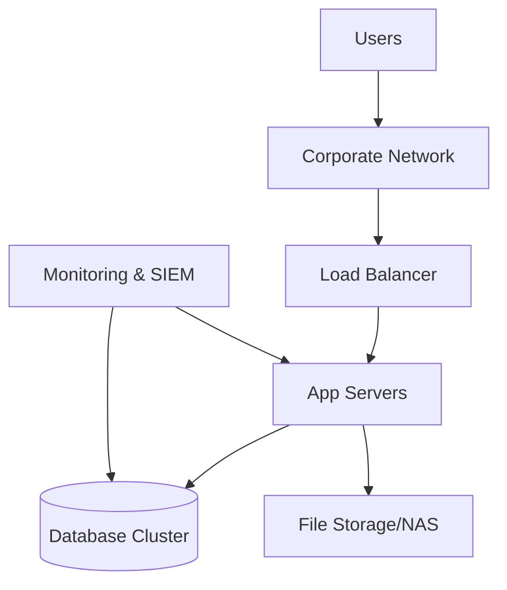
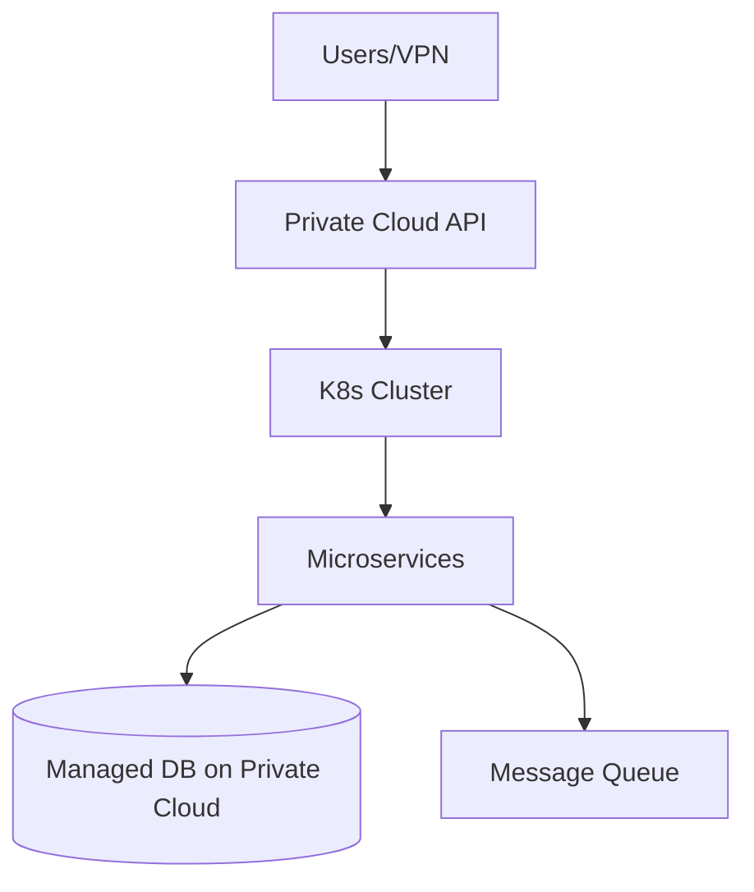
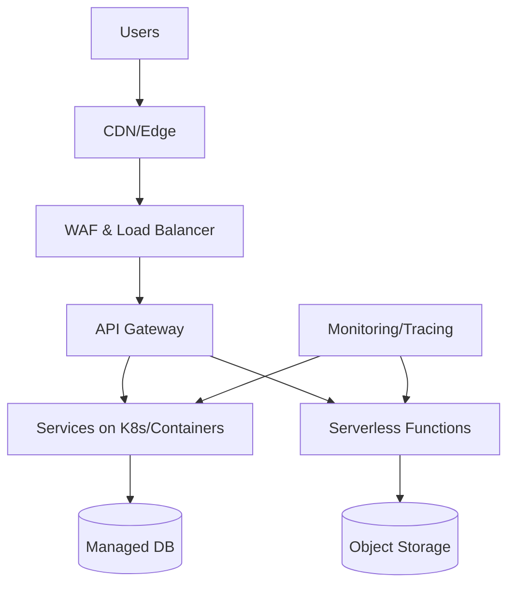
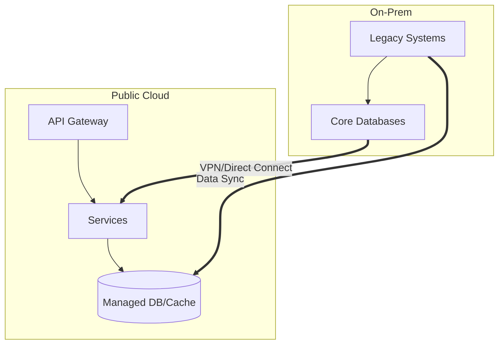
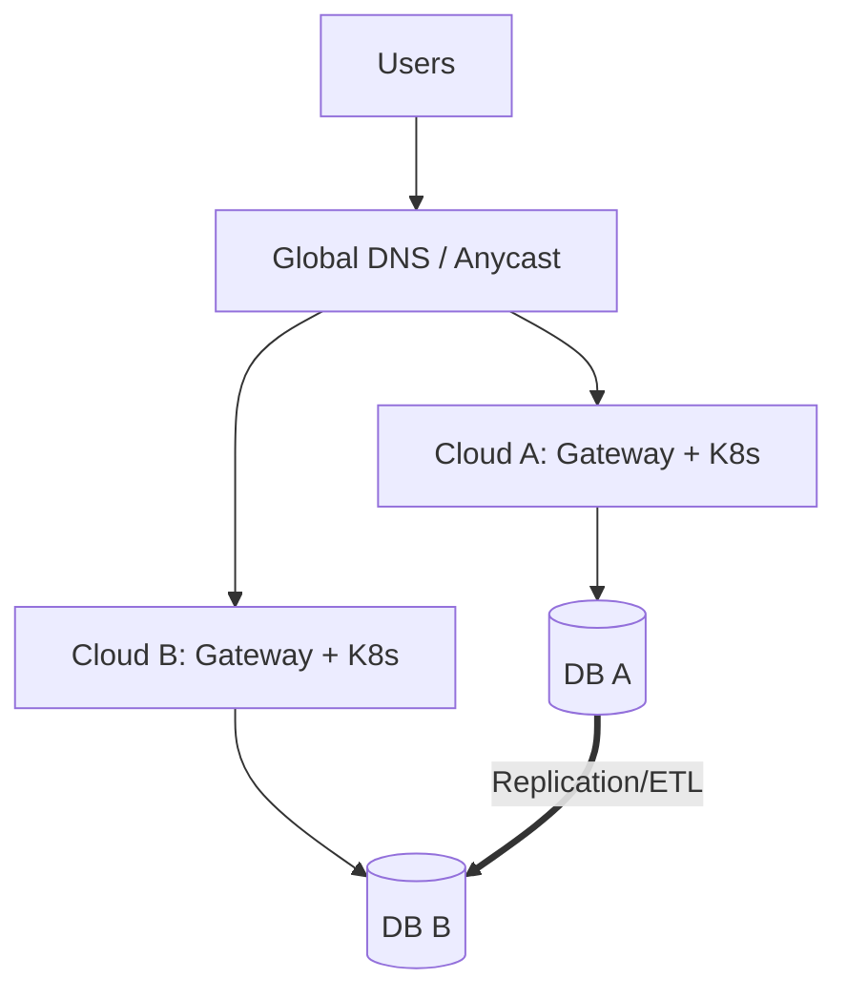
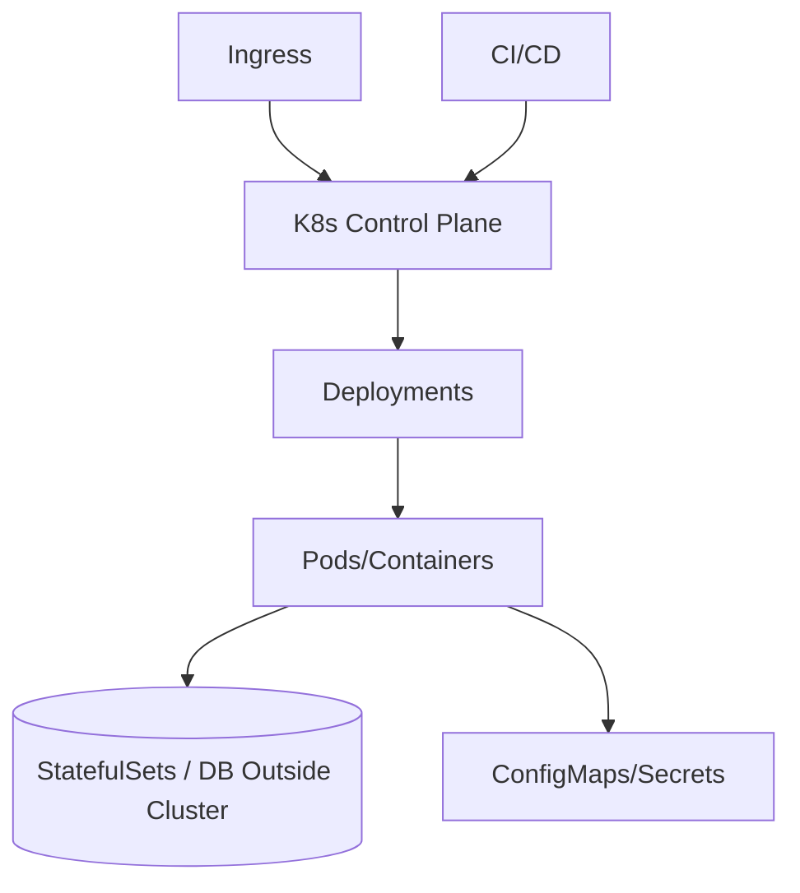
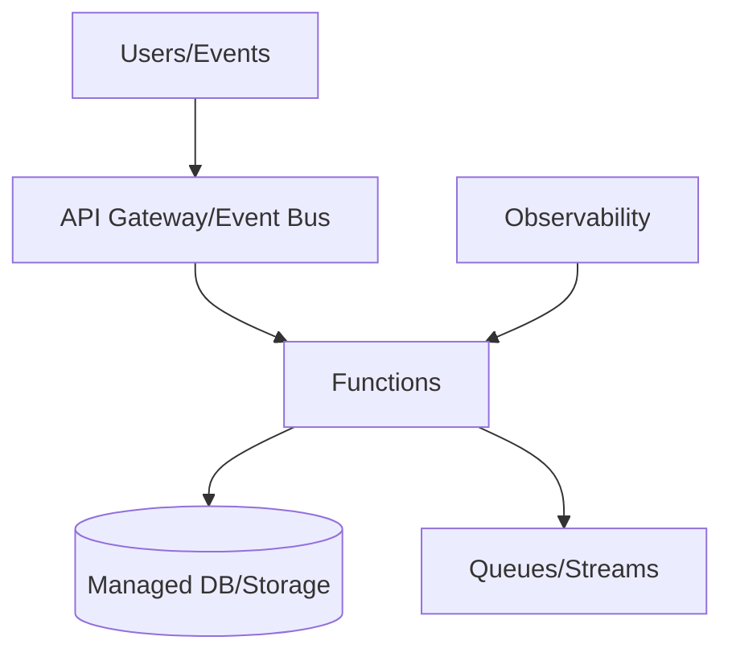
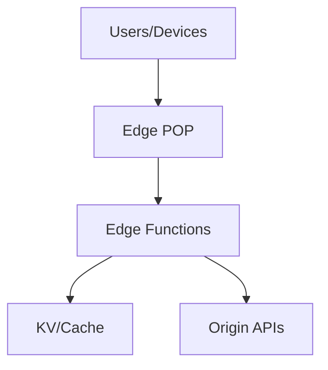
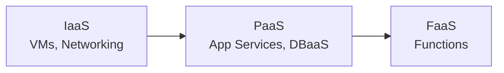

# Architecture by Deployment Model (Infrastructure)

## 7. **By Deployment Model** (Infrastructure)

This guide categorizes software architectures by how and where they are deployed. It mirrors the tone and structure used in `architecture-by-size-examples.md` with concise definitions, pros/cons, scenarios, and illustrative mermaid diagrams.

---

## 1. **On-Premises**
**Definition:** Infrastructure fully owned and operated in your data center.

**Pros:**
- **Control:** Full control over hardware, networking, security.
- **Compliance:** Meets strict data residency or regulatory needs.
- **Latency:** Close to internal systems.

**Cons:**
- **CapEx:** Upfront hardware costs and refresh cycles.
- **Scaling:** Slower to scale; procurement lead times.
- **Ops burden:** Power, cooling, racking, staff.

**Good for:** Highly regulated industries, tight data residency needs, legacy integrations.

---

## 2. **Private Cloud**
**Definition:** Cloud-like automation and APIs on dedicated hardware, either on-prem or hosted.

**Pros:**
- **Isolation:** Dedicated resources and strong tenancy.
- **Cloud ergonomics:** Self-service, IaC, automation.
- **Compliance:** Controlled environment with cloud patterns.

**Cons:**
- **Cost:** Premium for dedicated capacity.
- **Complexity:** You operate the platform.
- **Feature lag:** Fewer managed services vs public cloud.

**Good for:** Enterprises needing isolation with cloud-native workflows.

---

## 3. **Public Cloud (Single Cloud)**
**Definition:** Deploying to one major public cloud provider.

**Pros:**
- **Speed:** Fast provisioning and global reach.
- **Managed services:** Databases, queues, analytics.
- **Scalability:** Elastic and pay-as-you-go.

**Cons:**
- **Vendor lock-in:** Proprietary services/APIs.
- **Cost drift:** Requires governance to control spend.
- **Shared responsibility:** Security and reliability still on you.

**Good for:** Most startups and scale-ups optimizing for speed.

---

## 4. **Hybrid Cloud**
**Definition:** Combination of on-prem/private cloud with public cloud.

**Pros:**
- **Pragmatic:** Keep sensitive/legacy on-prem; burst to cloud.
- **Migration path:** Gradual modernization.
- **Resilience:** Multiple environments.

**Cons:**
- **Complexity:** Networking, identity, data sync.
- **Latency:** Cross-environment calls.
- **Operational overhead:** Two stacks to manage.

**Good for:** Phased migrations, data residency, tight legacy dependencies.

---

## 5. **Multi-Cloud**
**Definition:** Using two or more public clouds for portability or resilience.

**Pros:**
- **Avoid lock-in:** Negotiate and choose best-of-breed.
- **Resilience:** Survive regional/provider outages.
- **Geography:** Meet local compliance with different providers.

**Cons:**
- **Greatest complexity:** Networking, identity, data consistency.
- **Cost:** Duplicated infrastructure and ops.
- **Feature least-common-denominator:** Hard to use proprietary services.

**Good for:** Large enterprises with strong platform teams and clear ROI.

---

## 6. **Containers & Kubernetes**
**Definition:** Package apps as containers; orchestrate with Kubernetes (on any infra).

**Pros:**
- **Portability:** Run across clouds and on-prem.
- **Standardization:** Declarative, GitOps, strong ecosystem.
- **Density:** Efficient resource utilization.

**Cons:**
- **Operational learning curve:** Cluster, networking, security.
- **Day-2 ops:** Upgrades, backups, observability.
- **Stateful complexity:** DB best kept managed/outside.

**Good for:** Teams needing portability and consistent runtime across environments.

---

## 7. **Serverless**
**Definition:** Event-driven functions and managed services; scale-to-zero.

**Pros:**
- **No servers to manage:** Focus on business logic.
- **Elastic:** Auto-scaling and pay-per-use.
- **Velocity:** Fast to ship with managed building blocks.

**Cons:**
- **Cold starts:** Latency for sporadic traffic.
- **Limits:** Execution time/memory/connection constraints.
- **Lock-in:** Tighter coupling to provider services.

**Good for:** Spiky workloads, event-driven apps, prototypes, internal tooling.

---

## 8. **Edge Computing**
**Definition:** Compute close to users/devices at the network edge.

**Pros:**
- **Latency:** Milliseconds response near users.
- **Offload:** Cache and precompute at edge.
- **Resilience:** Degraded offline modes.

**Cons:**
- **State/Data:** Limited storage and consistency.
- **Debuggability:** Distributed execution.
- **Vendor-specific:** Edge platforms vary widely.

**Good for:** Global apps, personalization, IoT, real-time analytics.

---

## 9. **IaaS vs PaaS vs FaaS**
**Definition:** Abstraction levels of managed responsibility.

**IaaS:** Maximum control; you manage OS/runtime. Good for legacy lift-and-shift.

**PaaS:** Managed runtimes/services. Good balance of speed and control.

**FaaS:** Highest abstraction and elasticity; best for event-driven components.

---

## Selection Guide
- **Speed to market:** Public cloud, PaaS, serverless.
- **Portability:** Containers/Kubernetes, avoid proprietary services.
- **Compliance/residency:** On-prem, private cloud, hybrid.
- **Cost predictability:** On-prem/private for steady workloads; serverless for sporadic.
- **Global latency:** Edge + CDN, multi-region public cloud.

---

## Evolution Path
1. Start single public cloud with managed services.
2. Add containers/Kubernetes as teams and services grow.
3. Introduce edge/serverless for latency-sensitive and event-driven parts.
4. Move to hybrid or multi-cloud only with clear business drivers.

