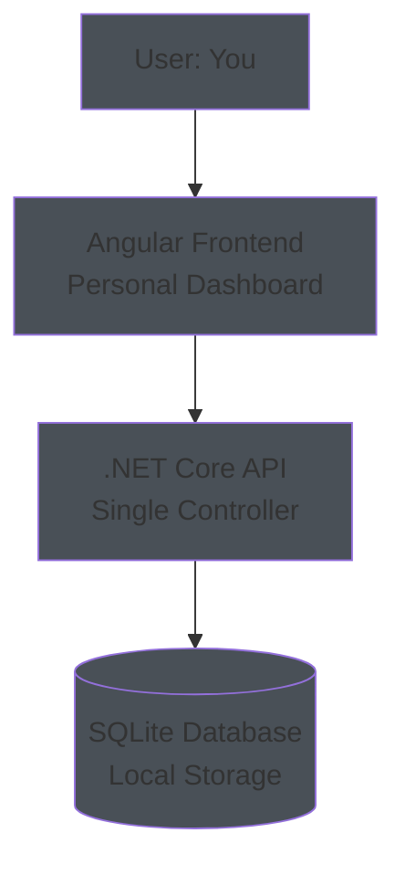
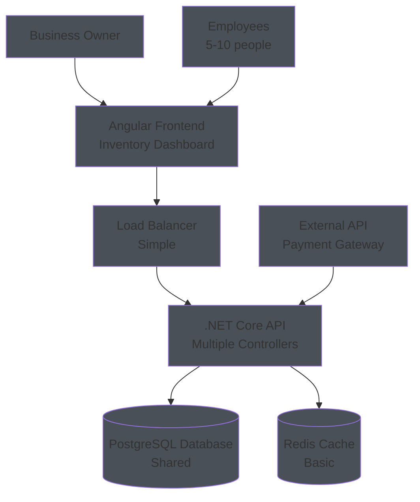
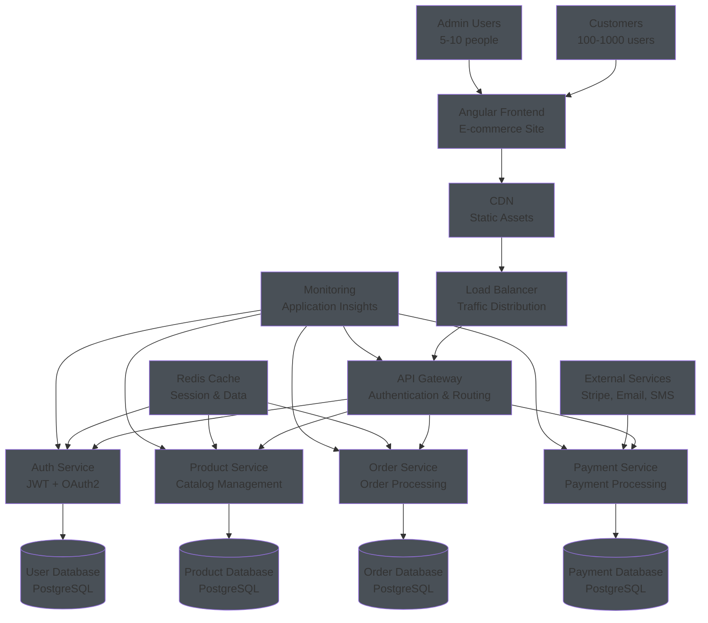
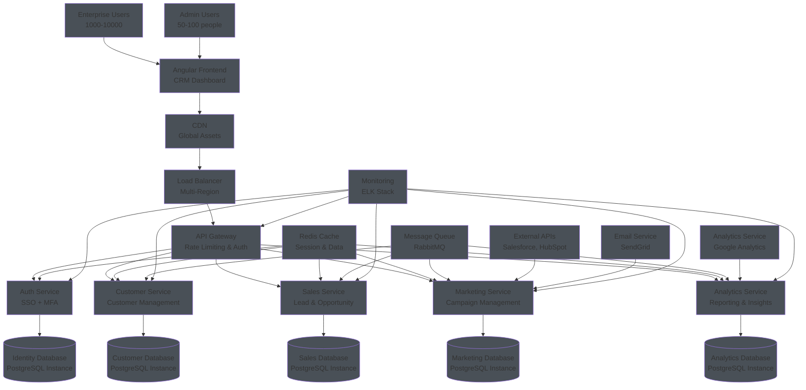
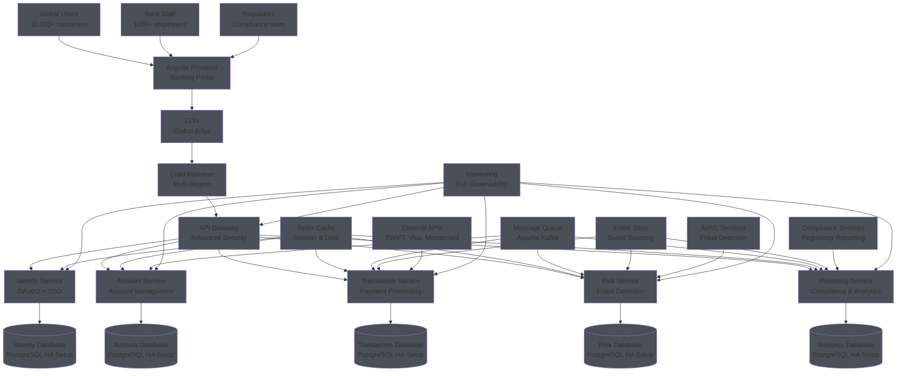

# Architecture by Application Size - Practical Examples

## 1. **Micro Applications** (1-10 users)
**Example: Personal Expense Tracker**

**Characteristics:**
- **Users:** Just you and maybe family
- **Data:** Personal expenses, categories, budgets
- **Features:** Add expenses, view reports, basic charts
- **Architecture:** Simple, everything on one server
- **Database:** SQLite (file-based, no server needed)
- **Deployment:** Local development or simple hosting

**Real Example:** A personal budget app you built to track your monthly expenses.

---

## 2. **Small Applications** (10-100 users)
**Example: Small Business Inventory Management**

**Characteristics:**
- **Users:** Small business team (5-20 people)
- **Data:** Products, inventory, orders, customers
- **Features:** CRUD operations, basic reporting, user roles
- **Architecture:** Layered, with basic separation
- **Database:** PostgreSQL (shared, reliable)
- **Deployment:** Single server with load balancer

**Real Example:** A small retail store's inventory management system.

---

## 3. **Medium Applications** (100-1,000 users)
**Example: Regional E-commerce Platform**

**Characteristics:**
- **Users:** Regional customers (100-1000)
- **Data:** Products, orders, payments, users, analytics
- **Features:** Full e-commerce, payment processing, user management
- **Architecture:** Microservices, API Gateway, caching
- **Database:** Multiple PostgreSQL databases (service-specific)
- **Deployment:** Multiple servers, cloud hosting

**Real Example:** A regional online store selling electronics to local customers.

---

## 4. **Large Applications** (1,000-10,000 users)
**Example: Enterprise CRM Platform**

**Characteristics:**
- **Users:** Enterprise customers (1000-10000)
- **Data:** Complex business data, integrations, analytics
- **Features:** Advanced CRM, integrations, reporting, automation
- **Architecture:** Microservices, message queues, distributed systems
- **Database:** Multiple specialized databases
- **Deployment:** Multi-region, auto-scaling, high availability

**Real Example:** A CRM platform used by multiple companies to manage their sales processes.

---

## 5. **Enterprise Applications** (10,000+ users)
**Example: Global Banking Platform**

**Characteristics:**
- **Users:** Global customers (10,000+)
- **Data:** Financial transactions, compliance, risk data
- **Features:** Banking operations, compliance, fraud detection, global reach
- **Architecture:** Event-driven, CQRS, distributed systems
- **Database:** Multiple database clusters, data replication
- **Deployment:** Multi-region, disaster recovery, compliance

**Real Example:** A global banking platform handling millions of transactions daily.

---

## Architecture Evolution Summary

| Size | Users | Complexity | Services | Database | Caching | Monitoring | Deployment |
|------|-------|------------|----------|----------|---------|------------|------------|
| **Micro** | 1-10 | Simple | 1 | SQLite | None | Basic | Local |
| **Small** | 10-100 | Moderate | 1-2 | PostgreSQL | Basic | Basic | Single Server |
| **Medium** | 100-1K | Complex | 3-5 | Multiple | Redis | Advanced | Cloud |
| **Large** | 1K-10K | Very Complex | 5-10 | Multiple Instances | Distributed | Full | Multi-Region |
| **Enterprise** | 10K+ | Highly Complex | 10+ | HA Setup | Global | Complete | Global |

---

## Key Evolution Patterns

### **1. Database Evolution**
- **Micro:** SQLite (file-based)
- **Small:** PostgreSQL (single instance)
- **Medium:** Multiple PostgreSQL instances
- **Large:** Multiple PostgreSQL instances with read replicas
- **Enterprise:** High Availability PostgreSQL setup with replication

### **2. Caching Evolution**
- **Micro:** No caching
- **Small:** Basic Redis
- **Medium:** Redis with session management
- **Large:** Redis with distributed caching
- **Enterprise:** Redis with global caching and edge locations

### **3. Monitoring Evolution**
- **Micro:** Basic logging
- **Small:** Application logs
- **Medium:** Application Insights
- **Large:** ELK Stack + APM
- **Enterprise:** Full observability with AI/ML

### **4. Security Evolution**
- **Micro:** Basic authentication
- **Small:** JWT tokens
- **Medium:** OAuth2 + API Gateway
- **Large:** SSO + MFA + Rate limiting
- **Enterprise:** Zero-trust + Compliance + Audit

---

## Your Path Forward

**Start with Micro/Small** and evolve as needed:
1. **Phase 1:** Personal project (Micro)
2. **Phase 2:** Small business tool (Small)
3. **Phase 3:** Growing platform (Medium)
4. **Phase 4:** Enterprise solution (Large)
5. **Phase 5:** Global platform (Enterprise)

Each phase builds on the previous one, so you can start simple and add complexity as your application grows!
