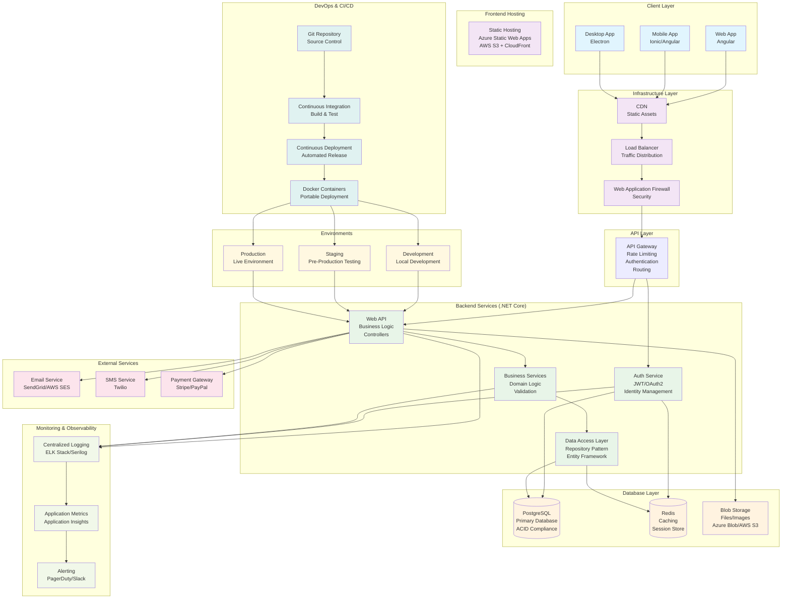

# Full-Stack Application Architecture Diagram

## High-Level System Architecture

## Data Flow Explanation

### 1. **Client Request Flow**
- User interacts with Angular web app, mobile app, or desktop app
- Requests go through CDN for static assets
- Dynamic requests go through Load Balancer → WAF → API Gateway

### 2. **Authentication Flow**
- API Gateway routes auth requests to Auth Service
- Auth Service validates credentials against PostgreSQL
- JWT tokens stored in Redis for session management

### 3. **Business Logic Flow**
- Authenticated requests go to Web API
- API calls Business Services for domain logic
- Data Access Layer handles database operations
- Results cached in Redis for performance

### 4. **External Integrations**
- Business services integrate with external APIs
- File uploads stored in Blob Storage
- Notifications sent via Email/SMS services

### 5. **Monitoring & Observability**
- All services log to centralized logging system
- Metrics collected for performance monitoring
- Alerts triggered for critical issues

### 6. **Deployment Pipeline**
- Code changes trigger CI/CD pipeline
- Automated testing and building
- Docker containers deployed to different environments

## Key Architectural Principles

1. **Separation of Concerns**: Each layer has specific responsibilities
2. **Scalability**: Horizontal scaling through load balancers and microservices
3. **Security**: Multiple security layers (WAF, Authentication, Authorization)
4. **Performance**: Caching, CDN, and optimized database queries
5. **Reliability**: Monitoring, logging, and alerting systems
6. **Maintainability**: Clean architecture and automated deployments

## Technology Stack Summary

- **Frontend**: Angular (Web), Ionic (Mobile), Electron (Desktop)
- **Backend**: .NET Core Web API
- **Database**: PostgreSQL (Primary), Redis (Cache)
- **Infrastructure**: Docker, Azure/AWS
- **DevOps**: Git, CI/CD Pipelines, Container Orchestration
- **Monitoring**: ELK Stack, Application Insights

