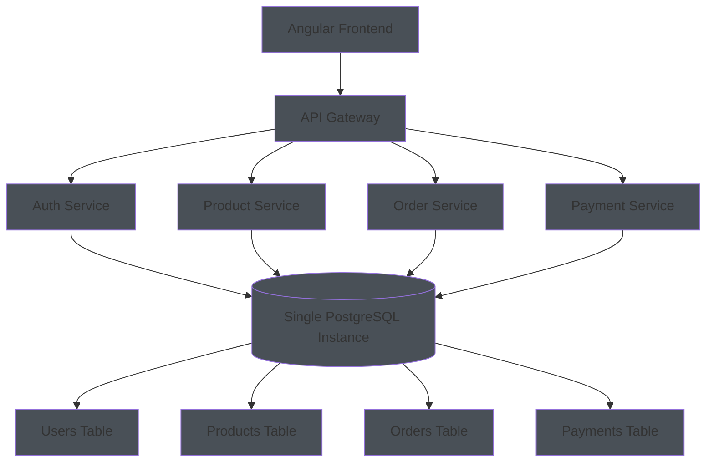
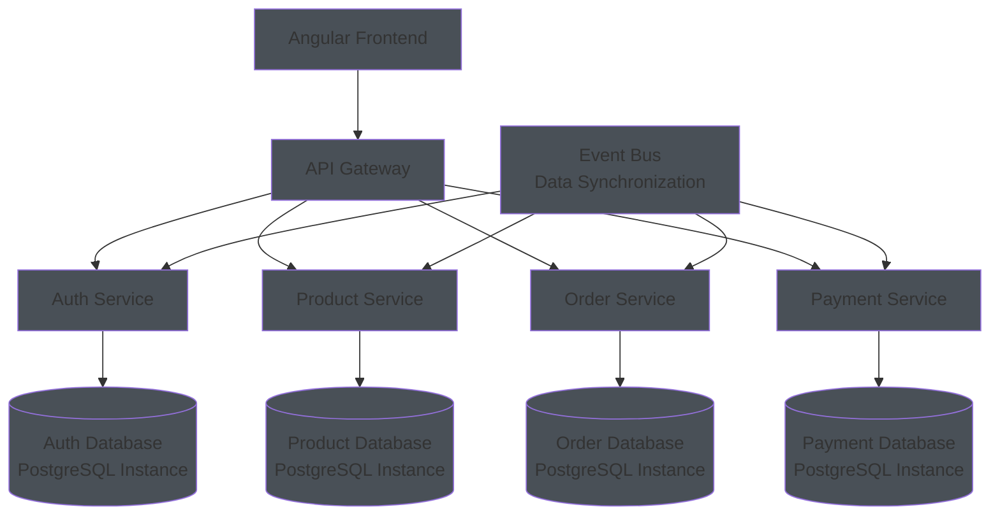
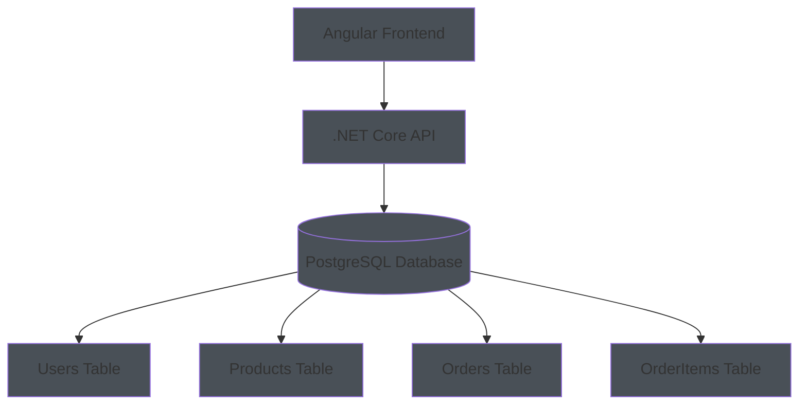
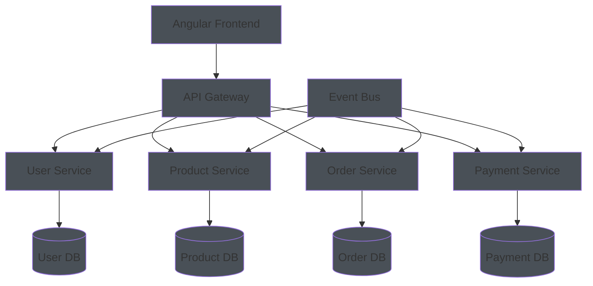
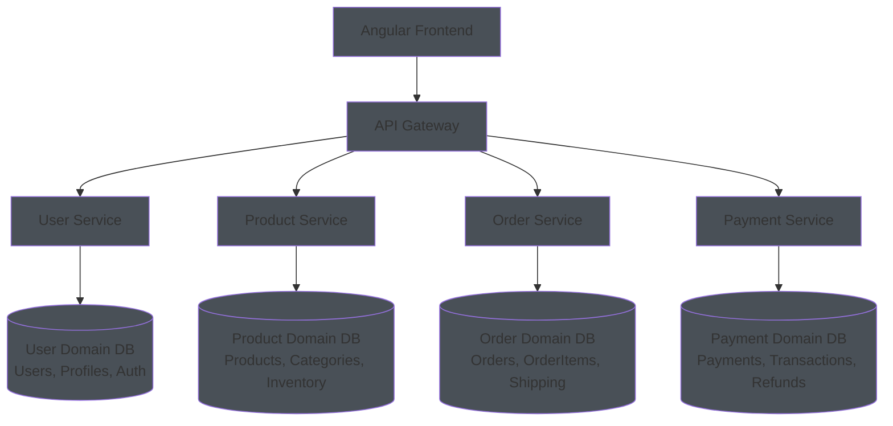
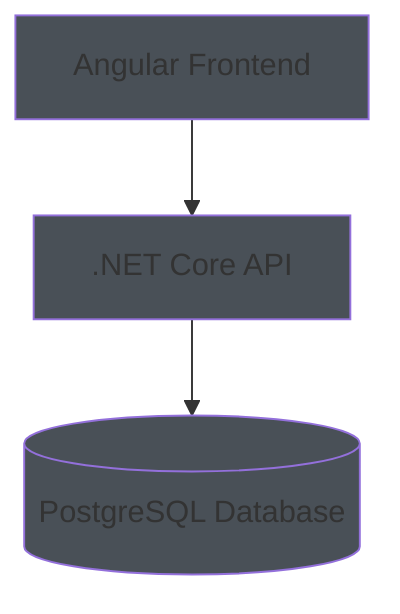
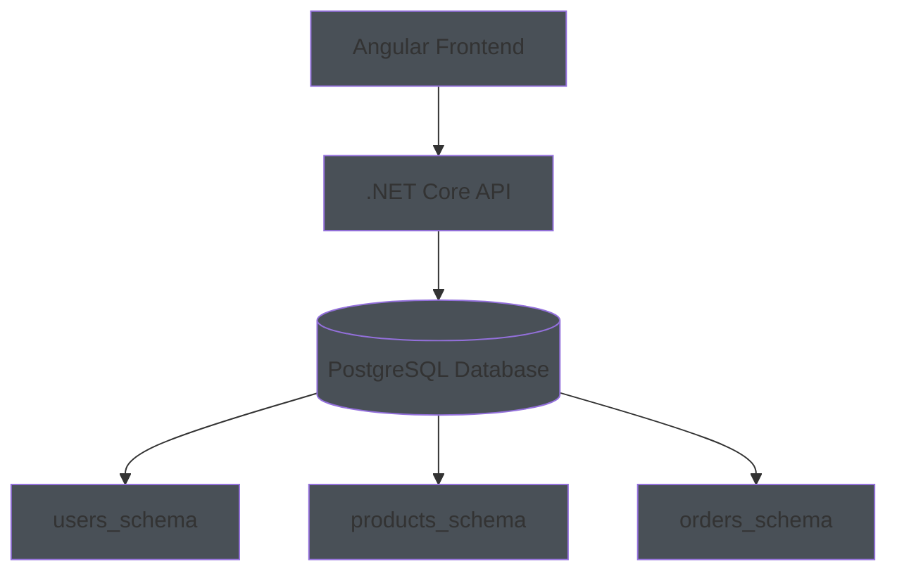
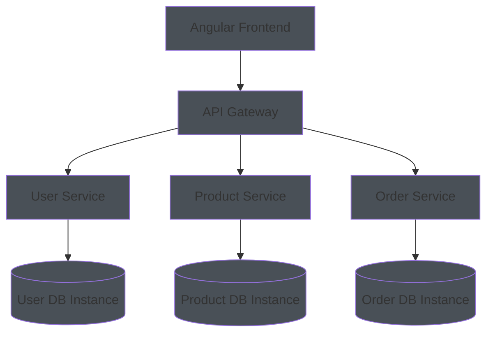

# Database Architecture Patterns: Single vs Multiple Databases

## The Two Approaches

### **Approach 1: Single Database (Shared Database)**
All services share one database with different tables/schemas

### **Approach 2: Database per Service (Microservices Pattern)**
Each service has its own dedicated database

---

## **Single Database Approach**

### **Architecture Example:**

### **Pros:**
✅ **Simpler to manage** - One database to backup, monitor, scale
✅ **ACID transactions** - Easy to maintain data consistency across services
✅ **Lower complexity** - No data synchronization issues
✅ **Cost effective** - Single database license and infrastructure
✅ **Easy joins** - Can query across different domains easily
✅ **Simpler development** - One connection string, one schema

### **Cons:**
❌ **Tight coupling** - Services are coupled through shared database
❌ **Single point of failure** - Database down = entire system down
❌ **Scaling challenges** - Hard to scale individual services independently
❌ **Technology lock-in** - All services must use same database technology
❌ **Deployment complexity** - Schema changes affect all services
❌ **Team conflicts** - Multiple teams working on same database

---

## **Database per Service Approach**

### **Architecture Example:**

### **Pros:**
✅ **Loose coupling** - Services are independent
✅ **Independent scaling** - Scale each database based on service needs
✅ **Technology diversity** - Each service can use different database
✅ **Team autonomy** - Teams can work independently
✅ **Fault isolation** - One service failure doesn't affect others
✅ **Independent deployment** - Schema changes don't affect other services

### **Cons:**
❌ **Complex data management** - Need to handle data consistency across services
❌ **No ACID across services** - Distributed transactions are complex
❌ **Data synchronization** - Need event-driven architecture for data sync
❌ **Higher complexity** - More moving parts to manage
❌ **Cost** - Multiple database instances
❌ **Cross-service queries** - Difficult to query across different databases

---

## **When to Use Each Approach**

### **Use Single Database When:**

#### **Small to Medium Applications (1-1,000 users)**
- **Team size:** 1-10 developers
- **Complexity:** Low to medium
- **Data relationships:** Strong relationships between entities
- **Consistency requirements:** High (financial, e-commerce)

**Example:** Small e-commerce site

#### **Monolithic Applications**
- **Architecture:** Traditional layered architecture
- **Deployment:** Single deployment unit
- **Team:** Single team owns entire application

#### **High Consistency Requirements**
- **Financial applications** - Need ACID transactions
- **Inventory management** - Stock updates must be consistent
- **E-commerce** - Order processing requires consistency

---

### **Use Database per Service When:**

#### **Large to Enterprise Applications (1,000+ users)**
- **Team size:** 10+ developers
- **Complexity:** High
- **Data domains:** Clear boundaries between business domains
- **Scaling requirements:** Independent scaling needed

**Example:** Large e-commerce platform

#### **Microservices Architecture**
- **Independent teams** - Each team owns a service
- **Different technologies** - Services can use different databases
- **Independent scaling** - Scale services based on demand

#### **Domain-Driven Design**
- **Bounded contexts** - Clear domain boundaries
- **Different data models** - Each domain has unique data requirements

---

## **Hybrid Approach: Database per Domain**

### **Best of Both Worlds:**
Group related services that share the same database

### **Benefits:**
✅ **Logical grouping** - Related services share database
✅ **Reduced complexity** - Fewer databases to manage
✅ **ACID within domain** - Consistency within business domain
✅ **Independent domains** - Domains can evolve independently

---

## **Evolution Path: Start Simple, Scale Up**

### **Phase 1: Single Database (Start Here)**

### **Phase 2: Schema Separation**

### **Phase 3: Database per Service**

---

## **Recommendations by Application Size**

| Size | Users | Recommended Approach | Database Strategy |
|------|-------|---------------------|-------------------|
| **Micro** | 1-10 | Single Database | One PostgreSQL instance |
| **Small** | 10-100 | Single Database | One PostgreSQL with schemas |
| **Medium** | 100-1K | Single Database | One PostgreSQL with schemas |
| **Large** | 1K-10K | Database per Domain | 2-3 databases by domain |
| **Enterprise** | 10K+ | Database per Service | Multiple databases |

---

## **Key Takeaways**

1. **Start Simple:** Begin with single database, evolve as needed
2. **Consider Team Size:** More teams = more databases
3. **Data Relationships:** Strong relationships = single database
4. **Consistency Requirements:** High consistency = single database
5. **Scaling Needs:** Independent scaling = multiple databases
6. **Technology Diversity:** Different needs = different databases

**For your Angular + .NET Core + PostgreSQL stack:**
- **Start with single database** for simplicity
- **Use schemas** to separate domains
- **Evolve to multiple databases** when you have multiple teams or need independent scaling
- **PostgreSQL supports both approaches** well

The key is to **start simple and evolve** based on your actual needs, not theoretical requirements!
