# Database Scaling Patterns: Single Instance vs Clusters

## **The Evolution of Database Scaling**

### **Phase 1: Single Database Instance**
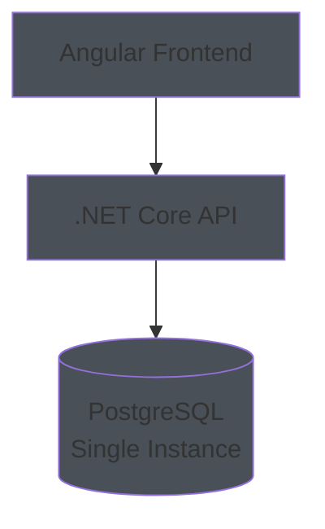

**What it is:**
- One PostgreSQL server running on one machine
- All data stored in one place
- Simple setup and management

**When to use:**
- Small to medium applications (1-1,000 users)
- Development and testing
- Simple applications with low traffic

---

### **Phase 2: Database with Read Replicas**
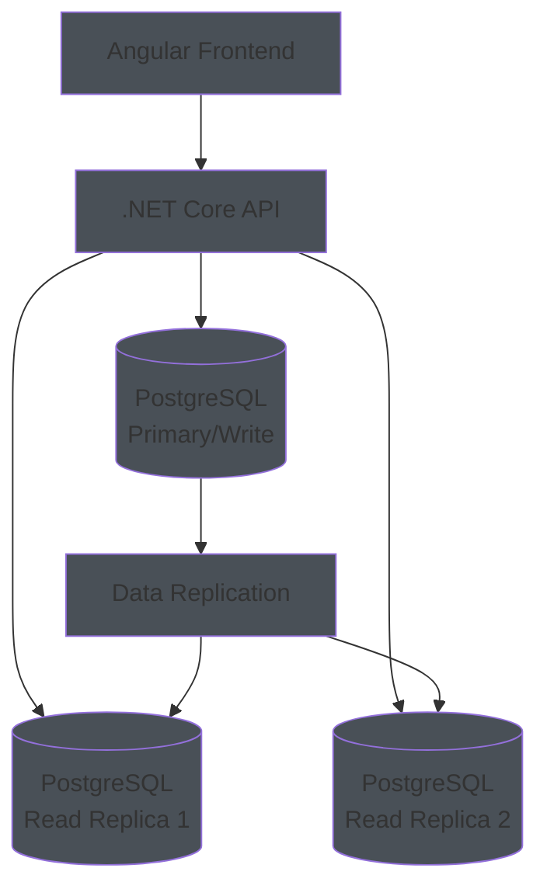

**What it is:**
- One primary database for writes
- Multiple read replicas for reads
- Data automatically replicated from primary to replicas

**When to use:**
- Medium applications (100-1,000 users)
- Read-heavy workloads
- Need better read performance

---

### **Phase 3: Database Cluster (High Availability)**
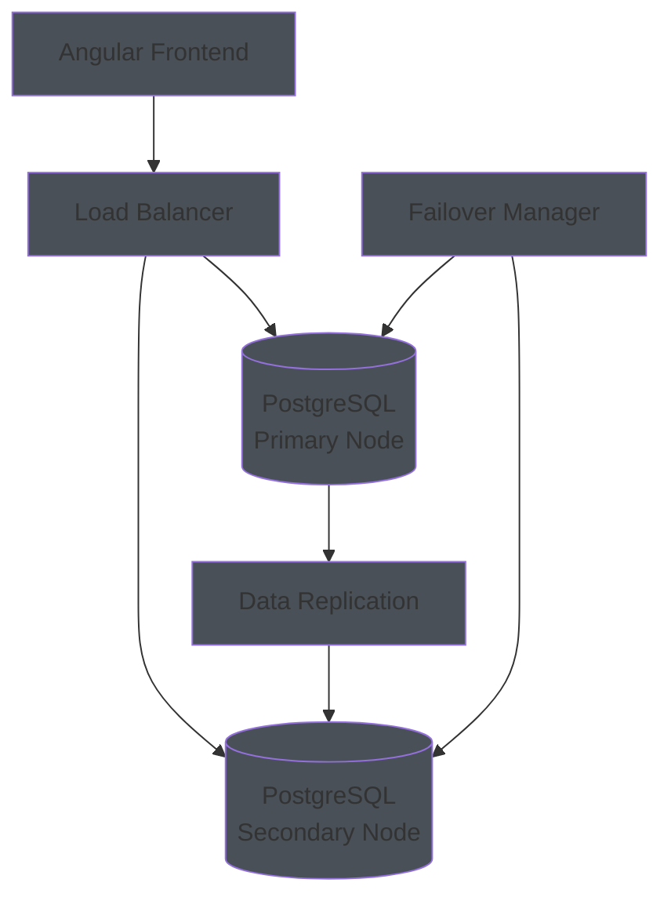

**What it is:**
- Multiple database nodes working together
- Automatic failover if primary fails
- High availability and reliability

**When to use:**
- Large applications (1,000+ users)
- Mission-critical systems
- Need 99.9%+ uptime

---

### **Phase 4: Distributed Database Cluster**
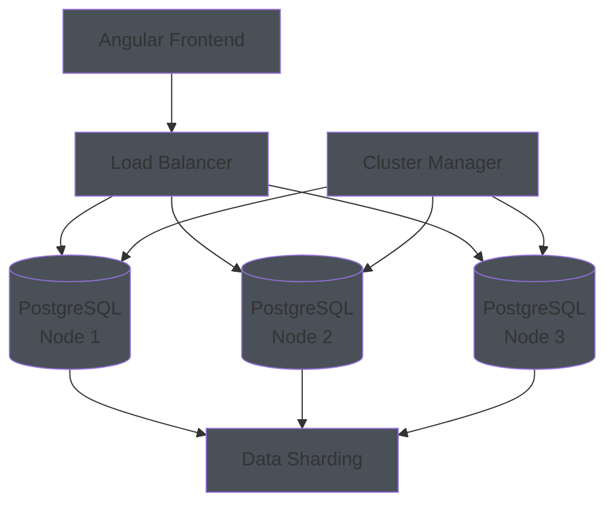

**What it is:**
- Multiple database nodes with data sharding
- Data distributed across multiple nodes
- Horizontal scaling capability

**When to use:**
- Enterprise applications (10,000+ users)
- Very large datasets
- Need horizontal scaling

---

## **Why I Used "SQL Cluster" in the Diagrams**

### **The Term "Cluster" is Misleading**

I used "PostgreSQL Cluster" in the enterprise diagrams, but this was **not entirely accurate**. Let me clarify what I actually meant:

### **What I Should Have Said:**

#### **For Large Applications (1,000-10,000 users):**
- **High Availability Setup** - Primary + Secondary with failover
- **Read Replicas** - Multiple read-only copies
- **Connection Pooling** - Manage database connections efficiently

#### **For Enterprise Applications (10,000+ users):**
- **Distributed Database** - Multiple database instances
- **Data Partitioning** - Split data across multiple databases
- **Advanced Monitoring** - Database performance monitoring

---

## **Real-World Database Scaling Patterns**

### **Pattern 1: Vertical Scaling (Scale Up)**
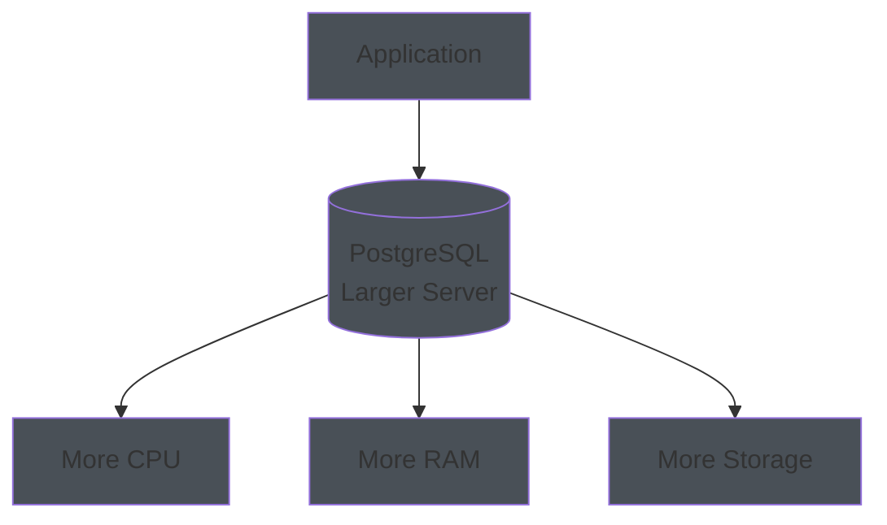

**What it is:**
- Upgrade server hardware
- More CPU, RAM, storage
- Keep single database instance

**When to use:**
- Small to medium applications
- Cost-effective scaling
- Simple management

---

### **Pattern 2: Read Replicas (Scale Out Reads)**
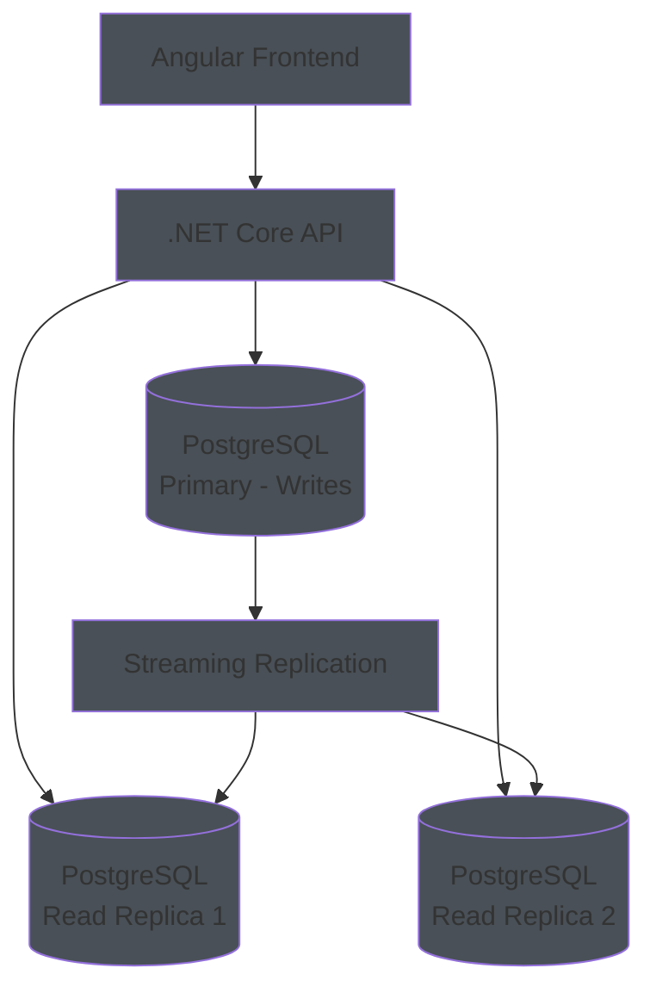

**What it is:**
- One primary for writes
- Multiple read replicas for reads
- Data automatically synchronized

**When to use:**
- Read-heavy applications
- Need better read performance
- Medium to large applications

---

### **Pattern 3: High Availability (HA) Setup**
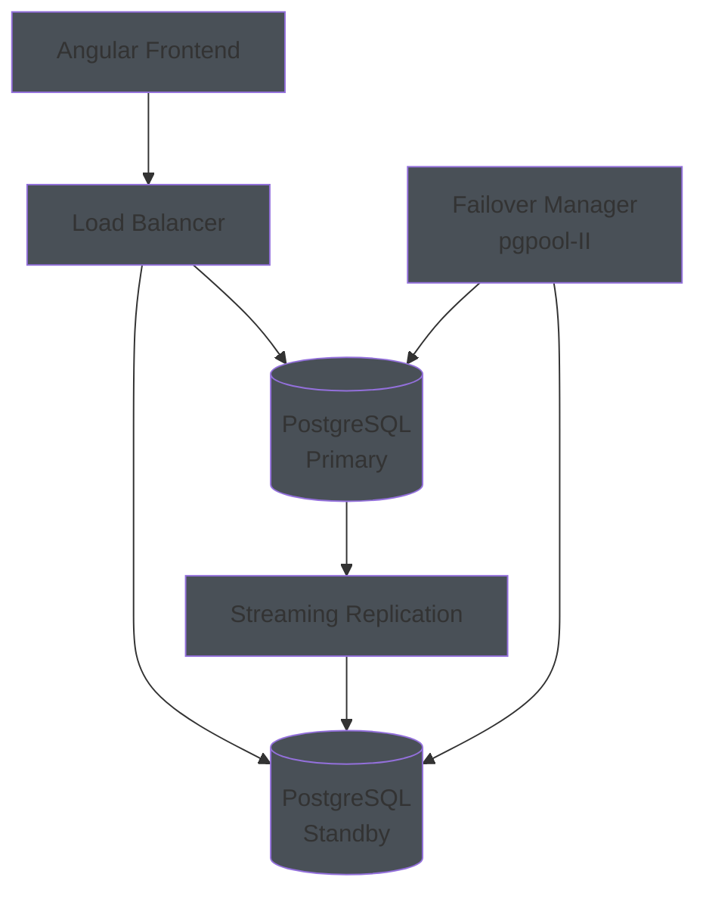

**What it is:**
- Primary and standby databases
- Automatic failover if primary fails
- High availability and reliability

**When to use:**
- Mission-critical applications
- Need 99.9%+ uptime
- Large applications

---

### **Pattern 4: Database Partitioning**
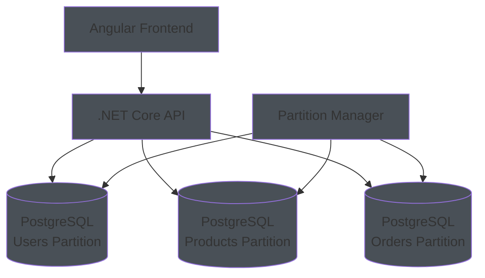

**What it is:**
- Split data across multiple databases
- Each database handles specific data
- Horizontal scaling

**When to use:**
- Very large datasets
- Need horizontal scaling
- Enterprise applications

---

## **Corrected Architecture by Size**

### **Micro Applications (1-10 users)**

### **Small Applications (10-100 users)**
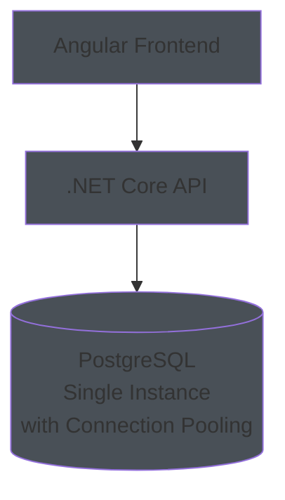

### **Medium Applications (100-1,000 users)**
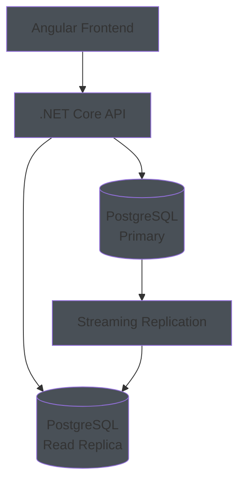

### **Large Applications (1,000-10,000 users)**
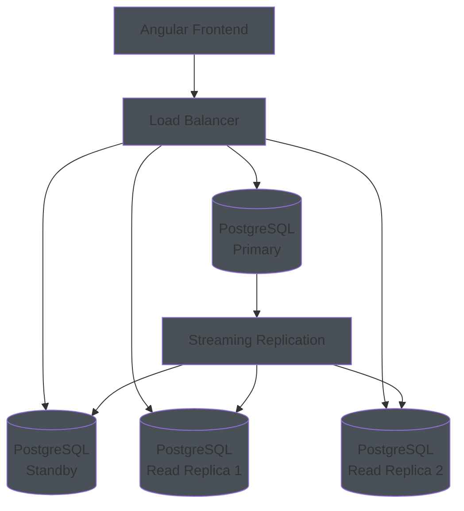

### **Enterprise Applications (10,000+ users)**
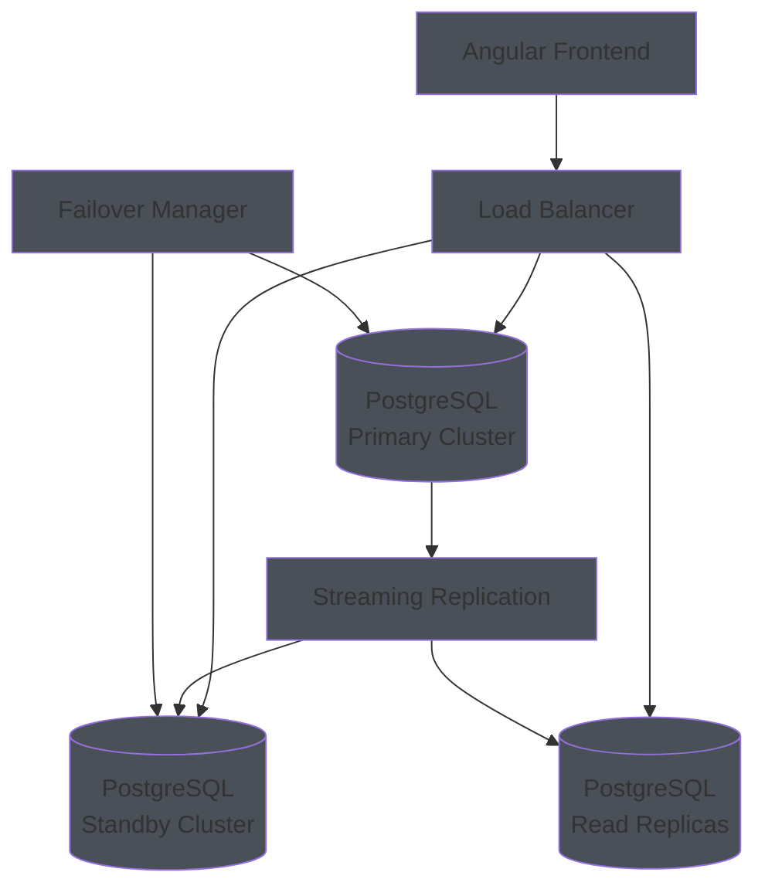

---

## **Key Takeaways**

1. **Start Simple:** Single PostgreSQL instance
2. **Scale Up First:** Upgrade hardware before adding complexity
3. **Add Read Replicas:** When you need better read performance
4. **High Availability:** When you need 99.9%+ uptime
5. **Distributed:** Only when you have very large datasets

**The term "cluster" was misleading - I should have been more specific about the actual scaling pattern needed for each application size.**

**For your Angular + .NET Core + PostgreSQL stack:**
- **Start with single instance** - Simple and effective
- **Add read replicas** - When you need better read performance
- **Add high availability** - When you need reliability
- **Consider distributed** - Only when you have massive scale

The key is to **scale based on actual needs**, not theoretical requirements!
