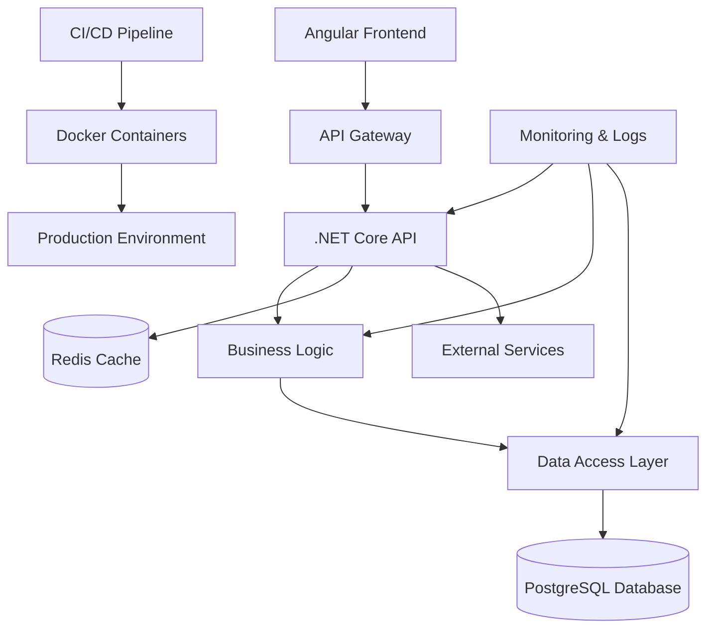
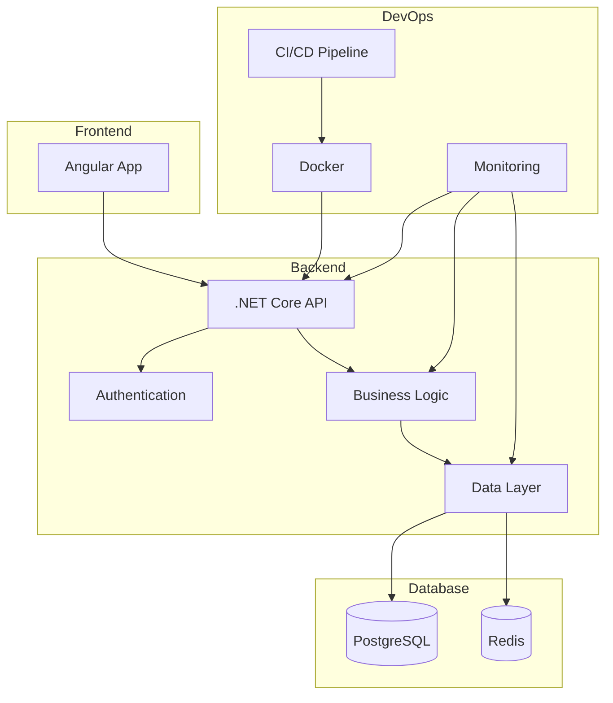
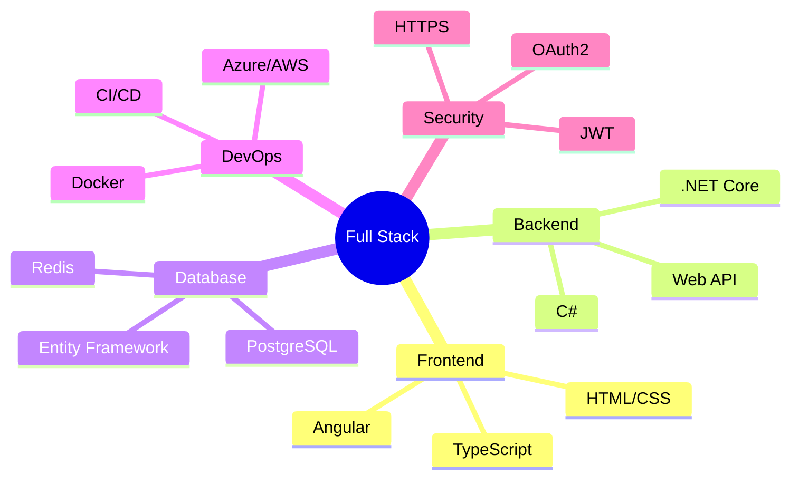

# Simple Full-Stack Architecture

## Basic System Flow

```mermaid
graph TD
    A[Angular Frontend] --> B[API Gateway]
    B --> C[.NET Core API]
    C --> D[Business Logic]
    D --> E[Data Access Layer]
    E --> F[(PostgreSQL Database)]
    
    C --> G[(Redis Cache)]
    C --> H[External Services]
    
    I[CI/CD Pipeline] --> J[Docker Containers]
    J --> K[Production Environment]
    
    L[Monitoring & Logs] --> C
    L --> D
    L --> E
```

## Detailed Architecture

```mermaid
graph TB
    subgraph "Frontend"
        FE[Angular App]
    end
    
    subgraph "Backend"
        API[.NET Core API]
        AUTH[Authentication]
        BIZ[Business Logic]
        DATA[Data Layer]
    end
    
    subgraph "Database"
        PG[(PostgreSQL)]
        REDIS[(Redis)]
    end
    
    subgraph "DevOps"
        CI[CI/CD Pipeline]
        DOCKER[Docker]
        MONITOR[Monitoring]
    end
    
    FE --> API
    API --> AUTH
    API --> BIZ
    BIZ --> DATA
    DATA --> PG
    DATA --> REDIS
    
    CI --> DOCKER
    DOCKER --> API
    
    MONITOR --> API
    MONITOR --> BIZ
    MONITOR --> DATA
```

## Technology Stack

```mermaid
mindmap
  root((Full Stack))
    Frontend
      Angular
      TypeScript
      HTML/CSS
    Backend
      .NET Core
      C#
      Web API
    Database
      PostgreSQL
      Redis
      Entity Framework
    DevOps
      Docker
      CI/CD
      Azure/AWS
    Security
      JWT
      OAuth2
      HTTPS
```

